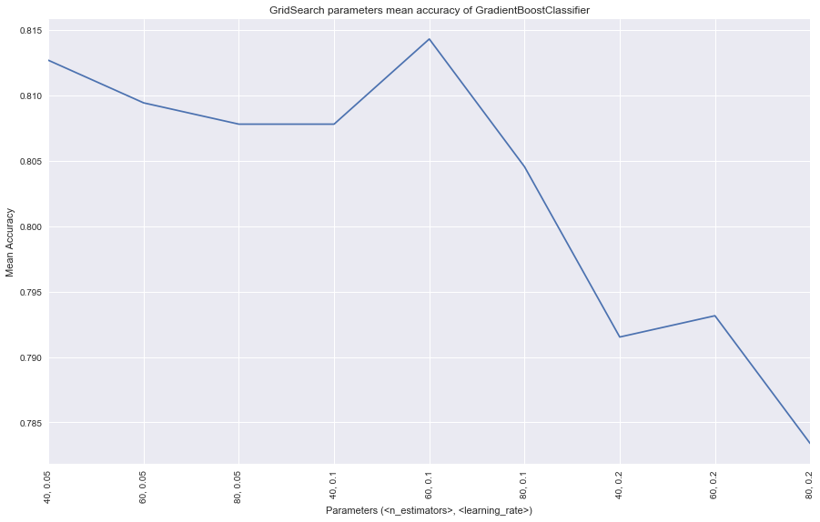

# Data Science Intro - Excercise 4 Solution
### Daniel & Liora

## Setup


```python
%pylab inline
pylab.rcParams['figure.figsize'] = (15, 9)
import pandas as pd
import seaborn as sb
sb.set(style='darkgrid')
import matplotlib.pyplot as plt

```

    Populating the interactive namespace from numpy and matplotlib
    


```python
df = pd.read_csv("./data/train.csv")
test = pd.read_csv("./data/test.csv")
test['Loan_Status'] = -1
df.shape

```


    (614, 13)


## Data Exploration

let's look at the table and examine both it's numerical values and non-numerical values to get a sense of the data we got


```python
df.head(10)
```


<div>
<style scoped>
    .dataframe tbody tr th:only-of-type {
        vertical-align: middle;
    }

    .dataframe tbody tr th {
        vertical-align: top;
    }

    .dataframe thead th {
        text-align: right;
    }
</style>
<table border="1" class="dataframe">
  <thead>
    <tr style="text-align: right;">
      <th></th>
      <th>Loan_ID</th>
      <th>Gender</th>
      <th>Married</th>
      <th>Dependents</th>
      <th>Education</th>
      <th>Self_Employed</th>
      <th>ApplicantIncome</th>
      <th>CoapplicantIncome</th>
      <th>LoanAmount</th>
      <th>Loan_Amount_Term</th>
      <th>Credit_History</th>
      <th>Property_Area</th>
      <th>Loan_Status</th>
    </tr>
  </thead>
  <tbody>
    <tr>
      <th>0</th>
      <td>LP001002</td>
      <td>Male</td>
      <td>No</td>
      <td>0</td>
      <td>Graduate</td>
      <td>No</td>
      <td>5849</td>
      <td>0.0</td>
      <td>NaN</td>
      <td>360.0</td>
      <td>1.0</td>
      <td>Urban</td>
      <td>Y</td>
    </tr>
    <tr>
      <th>1</th>
      <td>LP001003</td>
      <td>Male</td>
      <td>Yes</td>
      <td>1</td>
      <td>Graduate</td>
      <td>No</td>
      <td>4583</td>
      <td>1508.0</td>
      <td>128.0</td>
      <td>360.0</td>
      <td>1.0</td>
      <td>Rural</td>
      <td>N</td>
    </tr>
    <tr>
      <th>2</th>
      <td>LP001005</td>
      <td>Male</td>
      <td>Yes</td>
      <td>0</td>
      <td>Graduate</td>
      <td>Yes</td>
      <td>3000</td>
      <td>0.0</td>
      <td>66.0</td>
      <td>360.0</td>
      <td>1.0</td>
      <td>Urban</td>
      <td>Y</td>
    </tr>
    <tr>
      <th>3</th>
      <td>LP001006</td>
      <td>Male</td>
      <td>Yes</td>
      <td>0</td>
      <td>Not Graduate</td>
      <td>No</td>
      <td>2583</td>
      <td>2358.0</td>
      <td>120.0</td>
      <td>360.0</td>
      <td>1.0</td>
      <td>Urban</td>
      <td>Y</td>
    </tr>
    <tr>
      <th>4</th>
      <td>LP001008</td>
      <td>Male</td>
      <td>No</td>
      <td>0</td>
      <td>Graduate</td>
      <td>No</td>
      <td>6000</td>
      <td>0.0</td>
      <td>141.0</td>
      <td>360.0</td>
      <td>1.0</td>
      <td>Urban</td>
      <td>Y</td>
    </tr>
    <tr>
      <th>5</th>
      <td>LP001011</td>
      <td>Male</td>
      <td>Yes</td>
      <td>2</td>
      <td>Graduate</td>
      <td>Yes</td>
      <td>5417</td>
      <td>4196.0</td>
      <td>267.0</td>
      <td>360.0</td>
      <td>1.0</td>
      <td>Urban</td>
      <td>Y</td>
    </tr>
    <tr>
      <th>6</th>
      <td>LP001013</td>
      <td>Male</td>
      <td>Yes</td>
      <td>0</td>
      <td>Not Graduate</td>
      <td>No</td>
      <td>2333</td>
      <td>1516.0</td>
      <td>95.0</td>
      <td>360.0</td>
      <td>1.0</td>
      <td>Urban</td>
      <td>Y</td>
    </tr>
    <tr>
      <th>7</th>
      <td>LP001014</td>
      <td>Male</td>
      <td>Yes</td>
      <td>3+</td>
      <td>Graduate</td>
      <td>No</td>
      <td>3036</td>
      <td>2504.0</td>
      <td>158.0</td>
      <td>360.0</td>
      <td>0.0</td>
      <td>Semiurban</td>
      <td>N</td>
    </tr>
    <tr>
      <th>8</th>
      <td>LP001018</td>
      <td>Male</td>
      <td>Yes</td>
      <td>2</td>
      <td>Graduate</td>
      <td>No</td>
      <td>4006</td>
      <td>1526.0</td>
      <td>168.0</td>
      <td>360.0</td>
      <td>1.0</td>
      <td>Urban</td>
      <td>Y</td>
    </tr>
    <tr>
      <th>9</th>
      <td>LP001020</td>
      <td>Male</td>
      <td>Yes</td>
      <td>1</td>
      <td>Graduate</td>
      <td>No</td>
      <td>12841</td>
      <td>10968.0</td>
      <td>349.0</td>
      <td>360.0</td>
      <td>1.0</td>
      <td>Semiurban</td>
      <td>N</td>
    </tr>
  </tbody>
</table>
</div>


```python
df.describe()
```


<div>
<style scoped>
    .dataframe tbody tr th:only-of-type {
        vertical-align: middle;
    }

    .dataframe tbody tr th {
        vertical-align: top;
    }

    .dataframe thead th {
        text-align: right;
    }
</style>
<table border="1" class="dataframe">
  <thead>
    <tr style="text-align: right;">
      <th></th>
      <th>ApplicantIncome</th>
      <th>CoapplicantIncome</th>
      <th>LoanAmount</th>
      <th>Loan_Amount_Term</th>
      <th>Credit_History</th>
    </tr>
  </thead>
  <tbody>
    <tr>
      <th>count</th>
      <td>614.000000</td>
      <td>614.000000</td>
      <td>592.000000</td>
      <td>600.00000</td>
      <td>564.000000</td>
    </tr>
    <tr>
      <th>mean</th>
      <td>5403.459283</td>
      <td>1621.245798</td>
      <td>146.412162</td>
      <td>342.00000</td>
      <td>0.842199</td>
    </tr>
    <tr>
      <th>std</th>
      <td>6109.041673</td>
      <td>2926.248369</td>
      <td>85.587325</td>
      <td>65.12041</td>
      <td>0.364878</td>
    </tr>
    <tr>
      <th>min</th>
      <td>150.000000</td>
      <td>0.000000</td>
      <td>9.000000</td>
      <td>12.00000</td>
      <td>0.000000</td>
    </tr>
    <tr>
      <th>25%</th>
      <td>2877.500000</td>
      <td>0.000000</td>
      <td>100.000000</td>
      <td>360.00000</td>
      <td>1.000000</td>
    </tr>
    <tr>
      <th>50%</th>
      <td>3812.500000</td>
      <td>1188.500000</td>
      <td>128.000000</td>
      <td>360.00000</td>
      <td>1.000000</td>
    </tr>
    <tr>
      <th>75%</th>
      <td>5795.000000</td>
      <td>2297.250000</td>
      <td>168.000000</td>
      <td>360.00000</td>
      <td>1.000000</td>
    </tr>
    <tr>
      <th>max</th>
      <td>81000.000000</td>
      <td>41667.000000</td>
      <td>700.000000</td>
      <td>480.00000</td>
      <td>1.000000</td>
    </tr>
  </tbody>
</table>
</div>


```python
df['Property_Area'].value_counts()
```


    Semiurban    233
    Urban        202
    Rural        179
    Name: Property_Area, dtype: int64


```python
df['Self_Employed'].value_counts()
```


    No     500
    Yes     82
    Name: Self_Employed, dtype: int64


```python
df['Gender'].value_counts()
```


    Male      489
    Female    112
    Name: Gender, dtype: int64


```python
df['Married'].value_counts()
```


    Yes    398
    No     213
    Name: Married, dtype: int64


we can see that most of our applicants are not self employed, males with 2x married applicatns than singles. the only uniform distribution of data is in the property area


```python
df.boxplot(column='ApplicantIncome', by = 'Education')
```


    <matplotlib.axes._subplots.AxesSubplot at 0x1e419a229b0>


```python
df.boxplot(column='ApplicantIncome', by = 'Married')
```


    <matplotlib.axes._subplots.AxesSubplot at 0x1e419a349b0>


we can see that the average income is the same between 10000-20000 but educated or married applicants have the higher incomes

## Distribution Analysis


```python
df['LoanAmount'].hist(bins=50)
```


    <matplotlib.axes._subplots.AxesSubplot at 0x1e41bdbed68>


we saw earlier that loan amount mean was around 146, we can see that most of the data is around that number except some extreme cases

## Categorial Variable Analysis

let's examine credit history and loan status, we assume without credit history it will be harder to evaluate the chance of returning the loan so it is less likely to be approved


```python
df.pivot_table(values='Loan_Status',index=['Credit_History'],aggfunc=lambda x: x.map({'Y':1,'N':0}).mean())
```


<div>
<style scoped>
    .dataframe tbody tr th:only-of-type {
        vertical-align: middle;
    }

    .dataframe tbody tr th {
        vertical-align: top;
    }

    .dataframe thead th {
        text-align: right;
    }
</style>
<table border="1" class="dataframe">
  <thead>
    <tr style="text-align: right;">
      <th></th>
      <th>Loan_Status</th>
    </tr>
    <tr>
      <th>Credit_History</th>
      <th></th>
    </tr>
  </thead>
  <tbody>
    <tr>
      <th>0.0</th>
      <td>0.078652</td>
    </tr>
    <tr>
      <th>1.0</th>
      <td>0.795789</td>
    </tr>
  </tbody>
</table>
</div>


```python
temp3 = pd.crosstab(df['Credit_History'], df['Loan_Status'])
temp3.plot(kind='bar', stacked=True, color=['green','orange'], grid=False)
```


    <matplotlib.axes._subplots.AxesSubplot at 0x1e41c051dd8>


## Data Munging

first, we will check the table for missing values


```python
df = pd.concat([df, test])
```


```python
 df.apply(lambda x: sum(x.isnull()),axis=0) 
```


    Loan_ID               0
    Gender               24
    Married               3
    Dependents           25
    Education             0
    Self_Employed        55
    ApplicantIncome       0
    CoapplicantIncome     0
    LoanAmount           27
    Loan_Amount_Term     20
    Credit_History       79
    Property_Area         0
    Loan_Status           0
    dtype: int64


we will handle missing values by trying to predict the loan amount based on education and employment type. we'll fill na's in self-employed as 'no' since 86% of the applicatns are not self-employed so it will give us a good probability of being right


```python
df['Self_Employed'].fillna('No',inplace=True)
```


```python
table = df.pivot_table(values='LoanAmount', index='Self_Employed' ,columns='Education', aggfunc=np.median)
table
```


<div>
<style scoped>
    .dataframe tbody tr th:only-of-type {
        vertical-align: middle;
    }

    .dataframe tbody tr th {
        vertical-align: top;
    }

    .dataframe thead th {
        text-align: right;
    }
</style>
<table border="1" class="dataframe">
  <thead>
    <tr style="text-align: right;">
      <th>Education</th>
      <th>Graduate</th>
      <th>Not Graduate</th>
    </tr>
    <tr>
      <th>Self_Employed</th>
      <th></th>
      <th></th>
    </tr>
  </thead>
  <tbody>
    <tr>
      <th>No</th>
      <td>130.0</td>
      <td>117.0</td>
    </tr>
    <tr>
      <th>Yes</th>
      <td>150.0</td>
      <td>130.0</td>
    </tr>
  </tbody>
</table>
</div>


```python
def fage(x):
 return table.loc[x['Self_Employed'],x['Education']]
```


```python
df['LoanAmount'].fillna(df[df['LoanAmount'].isnull()].apply(fage, axis=1), inplace=True)
```

we don't want to remove the extreme values of income and loan amount since it is possible new applicant will have high incomes apply for a high loan amount. we will use log to normalize the extreme effect


```python
df['LoanAmount_log'] = np.log(df['LoanAmount'])
df['LoanAmount_log'].hist(bins=20)
```


    <matplotlib.axes._subplots.AxesSubplot at 0x1e41bb451d0>


instead of looking at the applicant income only we will sum the co applicant income as well and apply log to it to normalize high incomes


```python
df['TotalIncome'] = df['ApplicantIncome'] + df['CoapplicantIncome']
df['TotalIncome_log'] = np.log(df['TotalIncome'])
df['LoanAmount_log'].hist(bins=20) 
```


    <matplotlib.axes._subplots.AxesSubplot at 0x1e41c5802b0>


since loan amount term median is 360 we will replace na's with this value, since 85% of our applicants has credit history we will fill 1 instead of na's


```python
df['Loan_Amount_Term'].fillna(360, inplace=True)
df['Credit_History'].fillna(1, inplace=True)
```

let's look  at dependents in order to decide how to fill na's


```python
df['Dependents'].value_counts()
```


    0     545
    2     160
    1     160
    3+     91
    Name: Dependents, dtype: int64


since most has 0 dependents we will use it to replace na's


```python
df['Dependents'].fillna(0, inplace=True)
```

let's look at married vs single count


```python
df['Married'].value_counts()
```


    Yes    631
    No     347
    Name: Married, dtype: int64


```python
df['Married'].fillna('Yes', inplace=True)
```

now let's compare male vs female count


```python
df['Gender'].value_counts()
```


    Male      775
    Female    182
    Name: Gender, dtype: int64


```python
df['Gender'].fillna('Male', inplace=True)
```

that's it for filling na's!

## Feature Engineering

we will try and create some more significant features for better prediction


```python
df['LoanIncomeRatio'] =  np.round( (df['LoanAmount'] /df['TotalIncome']) / 0.005)
df['HasCoApplicant'] = np.where(df['CoapplicantIncome']>0, 1, 0)
df['LoanIncomeRatio'].hist(bins=50)
df['AmountPerTerm'] = df['LoanAmount'] / df['Loan_Amount_Term'] 

```


## Building a Predictive Model

we will use scikit, since scikit needs only numerical input we will convert the input types


```python
df.dtypes
```


    Loan_ID               object
    Gender                object
    Married               object
    Dependents            object
    Education             object
    Self_Employed         object
    ApplicantIncome        int64
    CoapplicantIncome    float64
    LoanAmount           float64
    Loan_Amount_Term     float64
    Credit_History       float64
    Property_Area         object
    Loan_Status           object
    LoanAmount_log       float64
    TotalIncome          float64
    TotalIncome_log      float64
    LoanIncomeRatio      float64
    HasCoApplicant         int32
    AmountPerTerm        float64
    dtype: object


```python
from sklearn.preprocessing import LabelEncoder
var_mod = ['Gender','Married','Dependents','Education','Self_Employed','Property_Area','Loan_Status']
le = LabelEncoder()
for i in var_mod:
    df[i] = le.fit_transform(df[i].astype(str))
```


```python
df.dtypes
```


    Loan_ID               object
    Gender                 int64
    Married                int64
    Dependents             int64
    Education              int64
    Self_Employed          int64
    ApplicantIncome        int64
    CoapplicantIncome    float64
    LoanAmount           float64
    Loan_Amount_Term     float64
    Credit_History       float64
    Property_Area          int64
    Loan_Status            int64
    LoanAmount_log       float64
    TotalIncome          float64
    TotalIncome_log      float64
    LoanIncomeRatio      float64
    HasCoApplicant         int32
    AmountPerTerm        float64
    dtype: object


```python
train = df.iloc[:614:]
test = df.iloc[614: :]
```

define a classification_model function which takes a model and determines accuracy and cross validation scores


```python
from sklearn.linear_model import LogisticRegression
from sklearn.cross_validation import KFold   
from sklearn.ensemble import RandomForestClassifier
from sklearn.tree import DecisionTreeClassifier, export_graphviz
from sklearn import metrics

def classification_model(model, data, predictors, outcome):
  model.fit(data[predictors],data[outcome])
  
  predictions = model.predict(data[predictors])
  
  accuracy = metrics.accuracy_score(predictions,data[outcome])
  print("Accuracy : %s" % "{0:.3%}".format(accuracy))

  kf = KFold(data.shape[0], n_folds=5)
  error = []
  for train, test in kf:
    train_predictors = (data[predictors].iloc[train,:])
    
    train_target = data[outcome].iloc[train]
    
    model.fit(train_predictors, train_target)
    
    error.append(model.score(data[predictors].iloc[test,:], data[outcome].iloc[test]))
 
  print("Cross-Validation Score : %s" % "{0:.3%}".format(np.mean(error)))

  model.fit(data[predictors],data[outcome]) 
```

    C:\Users\mille\Anaconda3\lib\site-packages\sklearn\cross_validation.py:41: DeprecationWarning: This module was deprecated in version 0.18 in favor of the model_selection module into which all the refactored classes and functions are moved. Also note that the interface of the new CV iterators are different from that of this module. This module will be removed in 0.20.
      "This module will be removed in 0.20.", DeprecationWarning)
    

## First Solution - KNN

we will first try to use the knn algorithm


```python
from sklearn.neighbors import KNeighborsClassifier
from sklearn.model_selection import GridSearchCV

 
knn = GridSearchCV( KNeighborsClassifier() , {'n_neighbors': np.arange(1, 30, 3), 'p': [1, 2, 3]}, cv=5)
outcome_var = 'Loan_Status'
predictor_var = ['TotalIncome_log','Credit_History', 'HasCoApplicant', 'AmountPerTerm', 'Education',]
classification_model(knn, train,predictor_var,outcome_var)

```

    Accuracy : 81.270%
    Cross-Validation Score : 81.271%
    


```python
knn.fit(train[predictor_var],train['Loan_Status'])
print(knn.best_params_)
```

    {'n_neighbors': 19, 'p': 2}
    

let's see a plot of the best parameters we found


```python
labels = []
for (n_nbors, p) in zip(knn.cv_results_['param_n_neighbors'], knn.cv_results_['param_p']):
    labels.append(str(n_nbors) + ', ' + str(p))
plt.plot(knn.cv_results_['mean_test_score'])
plt.xticks(range(0, len(labels)), labels, rotation='vertical')
plt.xlim([0, len(labels) - 1])
plt.xlabel('Parameters (<n_neighbors>, <p>)')
plt.ylabel('Mean Accuracy')
plt.title('GridSearch parameters mean accuracy of KNeighborsClassifier')
```


    Text(0.5,1,'GridSearch parameters mean accuracy of KNeighborsClassifier')


```python
ids = test['Loan_ID']
test = test.drop('Loan_ID', axis=1)
```


```python
result_knn = pd.DataFrame({'Loan_ID': ids.values, 'Loan_Status': knn.predict(test[predictor_var])})
result_knn['Loan_Status'] = np.where(result_knn['Loan_Status'] == 1, 'N', 'Y')
result_knn.to_csv('result_knn.csv', index=False)
```

here is the result we got with knn


## Second Solution - Gradient Boosting

for the second try we choose the gradient boosting classifier from sklearn


```python
from sklearn.ensemble import GradientBoostingClassifier

gbc = GridSearchCV(GradientBoostingClassifier(random_state=23), {'n_estimators': [40, 60, 80], 
                                                                 'learning_rate': [0.05, 0.1, 0.2],
                                                                 'max_depth' : [3,]}, cv=5)
outcome_var = 'Loan_Status'
predictor_var = ['LoanIncomeRatio' , 'HasCoApplicant','Credit_History', 'AmountPerTerm', 'Education']
classification_model(gbc, train,predictor_var,outcome_var)

```

    Accuracy : 85.016%
    Cross-Validation Score : 81.270%
    


```python
gbc.fit(train[predictor_var],train['Loan_Status'])
print(gbc.best_params_)
```

    {'learning_rate': 0.1, 'max_depth': 3, 'n_estimators': 60}
    

here is a plot of the best parameters we found


```python
labels = []
for (n_nbors, p) in zip(gbc.cv_results_['param_n_estimators'], gbc.cv_results_['param_learning_rate']):
    labels.append(str(n_nbors) + ', ' + str(p))
plt.plot(gbc.cv_results_['mean_test_score'])
plt.xticks(range(0, len(labels)), labels, rotation='vertical')
plt.xlim([0, len(labels) - 1])
plt.xlabel('Parameters (<n_estimators>, <learning_rate>)')
plt.ylabel('Mean Accuracy')
plt.title('GridSearch parameters mean accuracy of GradientBoostClassifier')
```


    Text(0.5,1,'GridSearch parameters mean accuracy of GradientBoostClassifier')





```python
test = test.drop('Loan_Status', axis=1)
result_gbc = pd.DataFrame({'Loan_ID': ids.values, 'Loan_Status': gbc.predict(test[predictor_var])})
result_gbc['Loan_Status'] = np.where(result_gbc['Loan_Status'] == 1, 'N', 'Y')
result_gbc.to_csv('result_gbc.csv', index=False)
```

here is the result we got with gbc

